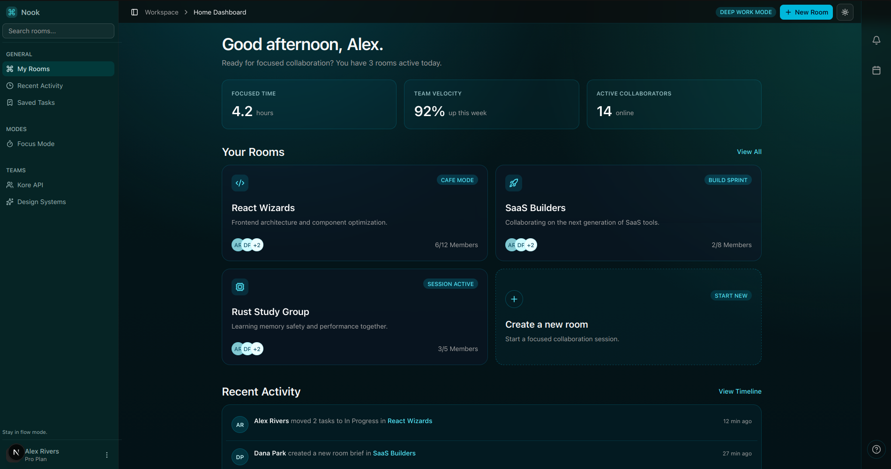

# Nook

Nook is a focused execution workspace for small teams.



It supports one daily loop:
1. Pick top tasks.
2. Start focused work from a task.
3. Resolve blockers in task discussion.
4. Review what moved.

## Core Features

- Room-based collaboration (create, join by code, invite members).
- Task board per room with drag-and-drop workflow:
  - `To Do`, `In Progress`, `Blocked`, `Completed`
  - filters, sorting, due presets, effort, assignee.
- Task discussion panel:
  - chat, file sharing, history.
- Focus mode:
  - timer sessions, intention/reflection, room presence.
- Dashboard execution layer:
  - Today plan, focus goal, room/activity overview.
- Profile and productivity:
  - status, availability, contribution/activity stats.

## Tech Stack

- Next.js 16 (App Router), React 19, TypeScript
- Tailwind CSS 4 + shadcn/ui + Radix
- Convex (data, auth, realtime)
- dnd-kit (kanban drag-and-drop)

## Prerequisites

- Node.js 20+
- npm 10+
- A Convex project/deployment URL

## Quick Start

1. Install dependencies.

```bash
npm install
```

2. Create `.env.local`.

```bash
NEXT_PUBLIC_CONVEX_URL=your_convex_deployment_url
NEXT_PUBLIC_CONVEX_SITE_URL=http://localhost:3000
```

Optional (email delivery for verification and invites):

```bash
RESEND_API_KEY=...
RESEND_FROM_EMAIL=Nook <no-reply@yourdomain.com>
```

3. Start development server.

```bash
npm run dev
```

4. Open `http://localhost:3000`.

## Scripts

- `npm run dev` - Start local development server
- `npm run build` - Build production bundle
- `npm run start` - Run production server
- `npm run lint` - Run ESLint

## Main Routes

- `/` Welcome
- `/sign-in`, `/sign-up`, `/verify-email`
- `/accept-invite`
- `/dashboard` Home dashboard
- `/dashboard/rooms/[roomId]` Room overview
- `/dashboard/rooms/[roomId]/tasks` Room task board
- `/dashboard/focus` Focus mode
- `/dashboard/profile` Profile
- `/dashboard/progress` Progress
- `/dashboard/recent-activity` Recent activity
- `/dashboard/saved-tasks` Saved tasks

## Product Direction

The focused product plan and roadmap are documented in [docs/execution-wedge-plan.md](docs/execution-wedge-plan.md).
